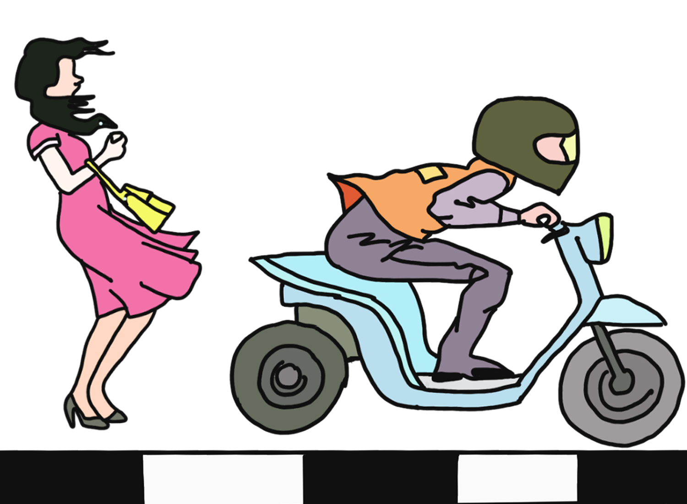

# SideWalkSolve - ระบบแก้ปัญหามอเตอร์ไซค์บนทางเท้า

  

โปรเจคนี้เป็นส่วนหนึ่งของรายวิชา 010123131 Software Development Practice I (1/2564)
คณะวิศวะกรรมคอมพิวเตอร์  มหาวิทยาลัยพระจอมเกล้าพระนครเหนือ
